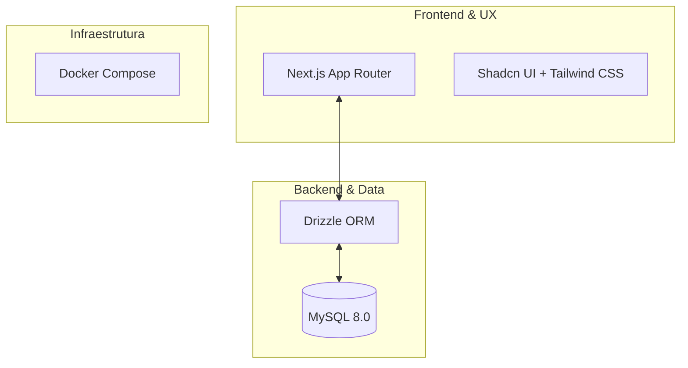
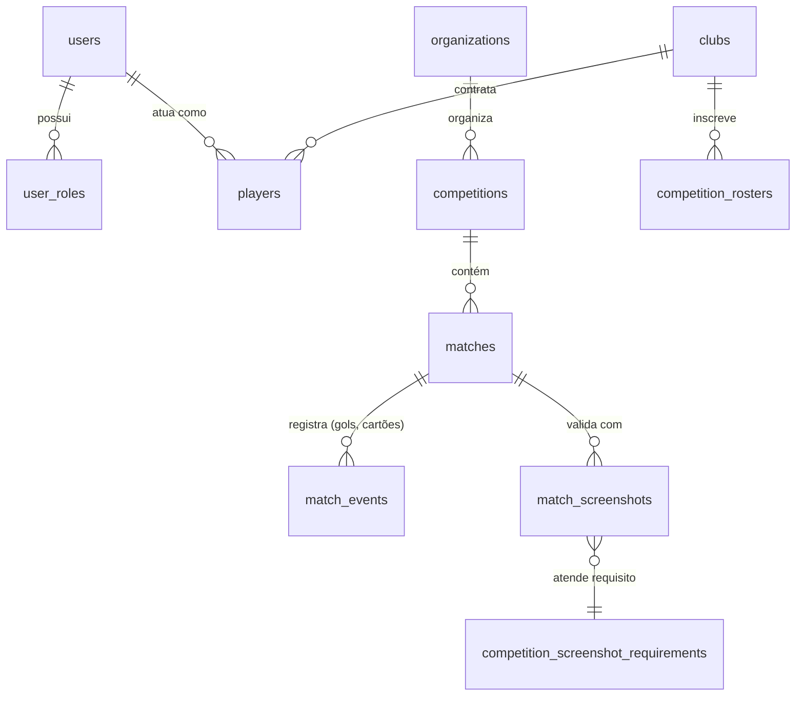
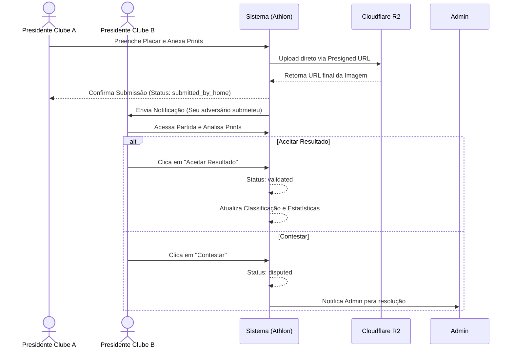

# Documentação do Sistema — Athlon

> **Versão:** 1.0 · **Revisão:** Março 2026 · **Status:** Em desenvolvimento ativo
>
> Fonte central de verdade do sistema Athlon. Cobre arquitetura, banco de dados, motor de competições e dados do ambiente de desenvolvimento.

---

## Sumário
1. [Visão Geral](#1-visão-geral)
2. [Arquitetura do Sistema](#2-arquitetura-do-sistema)
3. [Stack Tecnológica](#3-stack-tecnológica)
4. [Banco de Dados](#4-banco-de-dados)
5. [Estrutura de Perfis (Roles)](#5-estrutura-de-perfis-roles)
6. [Motor de Súmulas Inteligentes](#6-motor-de-súmulas-inteligentes-match-integrity)
7. [Dados de Teste e Ambiente](#7-dados-de-teste-e-ambiente)
8. [Identidade Visual](#8-identidade-visual)

---

## 1. Visão Geral

### 1.1 Objetivo
O **Athlon** é uma plataforma de gestão e engajamento para ecossistemas competitivos. Diferente de sistemas de tabelas estáticos, o Athlon funciona como uma rede social de performance, onde a hierarquia de perfis permite que um único usuário transite entre ser um atleta de e-sports, um jogador de futebol de várzea ou o gestor de um clube multigames.

### 1.2 Princípios de Design
| Princípio | Descrição |
| :--- | :--- |
| **Multimodalidade Nativa** | Trata "futebol" e "League of Legends" como modalidades com atributos customizáveis. |
| **Perfil Híbrido** | Transição fluida entre ser Jogador e Gestor (Presidente de Clube). |
| **Transparência** | Sistema de *reports* com validação visual (fotos/prints). |
| **Escalabilidade** | Organização geográfica por camadas (Mundo > País > Estado > Cidade). |

---

## 2. Arquitetura do Sistema



### 2.1 Estrutura de Diretórios
```text
athlon/
├── src/
│   ├── app/           # Rotas e Páginas (Next.js)
│   ├── components/    # Componentes UI (Shadcn + Custom)
│   ├── db/            # Schema do Drizzle e Conexão MySQL
│   ├── services/      # Lógica de negócio (Competition Engine)
│   └── lib/           # Utilitários (validadores, etc)
├── docs/              # Documentação oficial
├── docker-compose.yml
└── drizzle.config.ts
```

---

## 3. Stack Tecnológica

| Componente | Tecnologia | Detalhes |
| :--- | :--- | :--- |
| **Framework** | Next.js 15 | React, App Router, SSR/SSG integrados. |
| **Banco de Dados** | MySQL 8.0 | Executado via Docker. |
| **ORM** | Drizzle ORM | Gerencia migrações e consultas type-safe em TypeScript. |
| **Estilização** | Tailwind CSS 4 | Customização total e design system. |
| **Componentes** | Shadcn UI | Acessibilidade e visual premium (Lucide React, Framer Motion). |
| **Autenticação** | Auth.js v5 | Login, Registro, recuperação e Roles. |

---

## 4. Banco de Dados

### 4.1 Entidades Core
| Camada | Tabelas Principais | Descrição |
| :--- | :--- | :--- |
| **Identidade** | `users`, `roles`, `user_roles` | Core de conta e controle de acesso (RBAC). |
| **Flexibilidade** | `modalities`, `positions`, `stat_types` | (Futebol, CS2), posições e o que medir (Gols, Kills). |
| **Competitiva** | `clubs`, `competitions`, `matches`, `match_events` | Organizações, competições (regras em JSON), partidas e atômicos de jogo. |
| **Integridade (PRO)** | `competition_screenshot_requirements`, `match_screenshots` | Motor de Súmulas Inteligentes. Mapeia exigências de imagens configuradas pela org e armazena os uploads enviados pelos clubes para validação (Acordo Mútuo ou Admin). |

### 4.2 Diagrama Entidade-Relacionamento (Core)


---

## 5. Estrutura de Perfis (Roles)

| Perfil | Responsabilidade Principal | Regra de Negócio |
| :--- | :--- | :--- |
| **🔐 Admin** | Infraestrutura Global | Gestão de usuários, modalidades e exclusão global. |
| **🏛️ Pres. de Organização** | Arquiteto de Torneios | Funda federações, possui permissão exclusiva para criar competições. |
| **🛡️ Pres. de Clube** | Gestor de Equipe | Funda clube, gerencia elenco e inscreve a equipe em competições. |
| **👟 Jogador** | Atleta / Competidor | O átomo do sistema. Possui context switcher para atuar em várias modalidades. |

---

## 6. Motor de Súmulas Inteligentes (Match Integrity)

O fluxo de **Súmulas Inteligentes** é o coração da integridade esportiva da plataforma.
Ele substitui resultados baseados apenas em confiança por um sistema auditável.

### 6.1 Como funciona:
1. **Configuração da Competição**: O organizador (Presidente de Org) escolhe a política de envio (`resultSubmissionPolicy`):
   - `admin_only`: Só a organização insere resultados.
   - `manager_single`: Um manager submete e o resultado vai pra avaliação da org.
   - `manager_mutual` (Acordo Mútuo): Um manager submete e o adversário precisa analisar as provas e "Aceitar" ou "Contestar".
2. **Requisitos Fotográficos**: O organizador marca quais "Prints" são obrigatórios (ex: Print do Placar Final, Print do Lobby). O sistema não deixa a súmula passar sem essas imagens.
3. **Fluxo na Partida**: 
   - A partida possui uma máquina de estados (`submissionStatus`): `pending`, `submitted_by_home`, `submitted_by_away`, `disputed`, `validated`.
   - As imagens são enviadas diretamente para o **Cloudflare R2**.
   - Em caso de Contestação (`disputed`), a validação é travada para intervenção do Admin.

### 6.2 Diagrama de Sequência (Acordo Mútuo)


---

## 7. Dados de Teste e Ambiente

**Senha padrão para todos os usuários de teste:** `athlon123`

### 7.1 Superadmin (Acesso Total)
- **Login:** `admin@athlon.com`
- **Senha:** `athlon123`
- **Role:** `admin`

### 7.2 Clubes de Teste e Presidentes
| Clube | Tag | Modalidade | Presidente (Login) |
| :--- | :--- | :--- | :--- |
| **Alpha Esports** | ALP | FIFA 26 - Pro Clubs | `president1@athlon.com` |
| **Bravo Gaming** | BRV | FIFA 26 - Pro Clubs | `president2@athlon.com` |
| **Charlie Squad** | CHA | FIFA 26 - Pro Clubs | `president3@athlon.com` |
| **Delta Warriors** | DLT | FIFA 26 - Pro Clubs | `president4@athlon.com` |
| **Echo Force** | ECH | FIFA 26 - Pro Clubs | `president5@athlon.com` |
| **Foxtrot Elite** | FOX | FIFA 26 - Pro Clubs | `president6@athlon.com` |
| **Golf United** | GLF | FIFA 26 - Pro Clubs | `president7@athlon.com` |
| **Hotel Legends** | HTL | FIFA 26 - Pro Clubs | `president8@athlon.com` |
| **India Kings** | IND | FIFA 26 - Pro Clubs | `president9@athlon.com` |
| **Juliet Vikings** | JUL | FIFA 26 - Pro Clubs | `president10@athlon.com` |

### 7.3 Jogadores
Cada clube possui **10 membros** (1 Presidente + 9 Jogadores). Todos foram vinculados à modalidade do seu clube com posições definidas automaticamente.
*Exemplos:*
- `player_c1_p1@athlon.com` (Alpha Esports)
- `player_c3_p5@athlon.com` (Charlie Squad)
- `player_c10_p9@athlon.com` (Juliet Vikings)

*(Total: 110 usuários e 10 clubes gerados via seed `scripts/seed.ts`).*

---

## 8. Identidade Visual

Conceito **"O Vértice da Vitória"**: Letra 'A' estilizada unindo o esporte Real e Digital.

| Categoria | Hex | Nome | Aplicação |
| :--- | :--- | :--- | :--- |
| **Primária** | `#0A192F` | Midnight Navy | Fundo (Dark Mode), Sidebars. |
| **Acento** | `#00B4D8` | Athlon Azure | Botões, Links, Ícones ativos. |
| **Texto** | `#CAF0F8` | Digital Ice | Textos principais no Dark Mode. |
| **Suporte** | `#1E293B` | Slate Base | Cards, Inputs, Divisores. |
