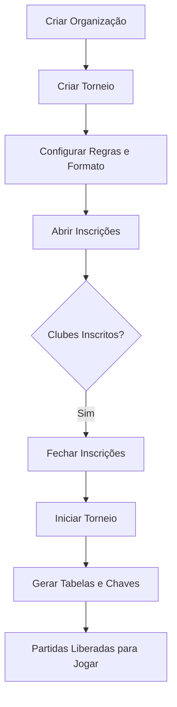
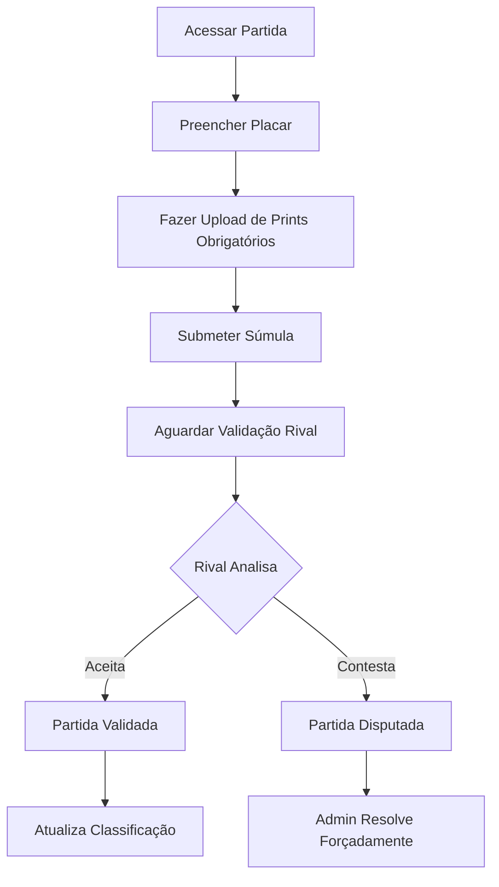
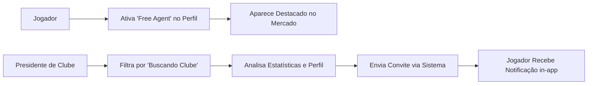

# Mapa de Requisitos e Casos de Uso — Athlon

> **Versão:** 1.0 · **Revisão:** Março 2026 · **Status:** Em desenvolvimento ativo
>
> Este documento cataloga todos os requisitos funcionais, não funcionais e casos de uso identificados para o projeto Athlon.

---

## Sumário
1. [Escopo e Limites do Sistema](#1-escopo-e-limites-do-sistema)
2. [Requisitos Funcionais](#2-requisitos-funcionais)
3. [Casos de Uso Principais](#3-casos-de-uso-principais)

---

## 1. Escopo e Limites do Sistema

| Domínio | Descrição |
| :--- | :--- |
| **Identidade** | Contas unificadas com identidades esportivas múltiplas (Context Switcher). |
| **Clubes** | Criação de organizações multimodais, gestão de elencos e contratos. |
| **Competições** | Organização de torneios com formatos de pontos corridos e eliminatória. |
| **Súmulas e Validação** | Registro atômico de eventos (gols, cartões) com necessidade de aprovação. |
| **Estatísticas** | Líderes de estatísticas, hall de troféus, prestígio de clubes. |
| **Engajamento** | Feed interativo, mercado de agentes livres. |

### 1.1 Atores do Sistema
- **Admin**: Gestão técnica.
- **Presidente de Organização**: Criador exclusivo de competições e federações.
- **Presidente de Clube**: Gestor de equipe e inscrições.
- **Jogador**: Atleta focado em desempenho e resultados.

---

## 2. Requisitos Funcionais

### RF-01 — Autenticação e Perfis
| ID | Requisito |
| :--- | :--- |
| RF-01.1 | O sistema deve possuir roles hierárquicos: Admin, Presidente de Org, Presidente de Clube, Jogador. |
| RF-01.2 | O sistema deve permitir que um jogador possua atributos diferentes (posições) dependendo da modalidade. |

### RF-02 — Clubes e Elenco
| ID | Requisito |
| :--- | :--- |
| RF-02.1 | O sistema deve permitir fundar clubes e associar jogadores através de convites. |
| RF-02.2 | O sistema deve organizar o clube em departamentos (Futebol, E-sports, etc). |
| RF-02.3 | Presidentes de Clube podem editar ou dispensar membros do seu elenco. |

### RF-03 — Competições e Execução
| ID | Requisito |
| :--- | :--- |
| RF-03.1 | Apenas Presidentes de Organização podem criar novos torneios. |
| RF-03.2 | O motor de competições deve gerar tabelas de Round Robin automaticamente. |
| RF-03.3 | O motor de competições deve gerar chaves eliminatórias (bracket) com auto-progressão de vencedores. |
| RF-03.4 | O sistema deve possuir travas de inscrição (limite de jogadores, janelas temporais). |
| RF-03.5 | Configuração avançada de pontuação e critérios de desempate via drag-and-drop. |

### RF-04 — Súmulas e Estatísticas
| ID | Requisito |
| :--- | :--- |
| RF-04.1 | As súmulas de partida devem suportar registro atômico baseado nos tipos de eventos da modalidade (Ex: Gols, Kills) e estatísticas em profundidade de jogadores (rating, defesas). |
| RF-04.2 | Resultados devem passar por validação pelo organizador do torneio através de **Súmulas Inteligentes**. O organizador define se a súmula requer validação simples do Admin ou Acordo Mútuo entre clubes. |
| RF-04.2.1 | As Súmulas Inteligentes exigirão uploads de Imagens OBRIGATÓRIAS definidos pelo dono da competição (Ex: Print da Tela Final, Print do Lobby). O upload vai para o R2. |
| RF-04.3 | O sistema deve acumular pontos de prestígio para clubes baseados em vitórias/empates. |
| RF-04.4 | Exibição de líderes de torneio, gráficos de rating individual e galeria de troféus. |

### RF-05 — Comunicação (Fase 7 e 8)
| ID | Requisito |
| :--- | :--- |
| RF-05.1 | O sistema deve ter um feed interativo em competições (reações, comentários). |
| RF-05.2 | Jogadores podem se declarar "Free Agents" num mercado ativo. |
| RF-05.3 | O sistema deverá suportar upload de provas de súmulas via Cloudflare R2 (Screenshots). |
| RF-05.4 | Notificações push/email sobre jogos e convites. |

---

## 3. Casos de Uso Principais

### UC-01: Criação e Gestão de Competições
**Ator:** Presidente de Organização

Este caso de uso descreve o fluxo de fundação de um torneio, desde as configurações iniciais até a geração automática dos jogos e tabelas.

**Fluxo Principal:**
1. Cria a organização via Wizard interativo.
2. Cria o torneio vinculado à organização, definindo regras, formato (Pontos Corridos ou Mata-mata) e critérios de desempate via arrastar-e-soltar.
3. Abre janelas de inscrição para permitir que os Presidentes de Clube solicitem a entrada de suas equipes.
4. Ao fechar as inscrições, o organizador clica em "Iniciar Torneio". O motor de competições gera automaticamente a tabela de partidas (Round Robin) ou a árvore do torneio (Bracket de Mata-mata).
5. Durante o torneio, o organizador atua como validador de resultados caso haja disputas ou se a configuração exigir aprovação administrativa.

**Diagrama de Fluxo:**

### UC-02: Envio e Validação de Súmula (Match Integrity)
**Ator:** Presidente de Clube

Este caso garante a confiabilidade dos dados da plataforma através do sistema de submissão de resultados baseados em evidências visuais (prints).

**Fluxo Principal (Cenário: Acordo Mútuo):**
1. O presidente acessa a aba de partidas do torneio e entra em uma partida específica que está "Pendente".
2. Durante o jogo real, ele pode registrar eventos atômicos em tempo real na interface (ex: Gols, Cartões Amarelos).
3. Após o encerramento do jogo real, a tela exibe os requisitos obrigatórios definidos pela Organização (ex: "Print do Placar", "Estatísticas do Time").
4. O presidente preenche o placar final e faz o upload (Presigned URL para o Cloudflare R2) das imagens comprobatórias e submete a súmula.
5. O estado da partida transiciona de `pending` para `submitted_by_home` (ou `away`).
6. O Presidente do Clube rival recebe uma notificação, acessa a partida, visualiza os prints anexados pelo primeiro, e escolhe entre **Aceitar Resultado** ou **Contestar**.
7. Se aceitar, a partida vai para `validated` e os pontos de prestígio, classificação e estatísticas são atualizados e publicados.

**Fluxo Alternativo (Contestação):**
1. No passo 6, se o rival não concordar com o placar/prints ou houver irregularidades, ele clica em **Contestar (Disputar)**.
2. O estado muda para `disputed`, bloqueando a validação para os clubes e exigindo a resolução por um Administrador ou Presidente da Organização.

**Diagrama de Fluxo:**

### UC-03: Exploração e Mercado de Agentes Livres
**Atores:** Jogador, Presidente de Clube

Este fluxo incentiva o engajamento através de um mercado "vivo" de jogadores buscando oportunidades.

**Fluxo Principal:**
1. **Jogador:** Acessa seu perfil e na aba de modalidade, ativa a chave "Buscando Clube (Free Agent)", podendo adicionar uma breve mensagem de apresentação.
2. **Presidente:** Acessa o "Mercado de Jogadores" e utiliza os filtros (Modalidade, Posição) e marca o filtro "Free Agents".
3. **Presidente:** O sistema destaca visualmente os jogadores com status "Free Agent".
4. **Presidente:** Clica no card do jogador, verifica suas estatísticas e troféus em torneios anteriores.
5. **Presidente:** Envia um convite de recrutamento direto para o jogador, que receberá um alerta no sino de notificações globais in-app.

**Diagrama de Fluxo:**

